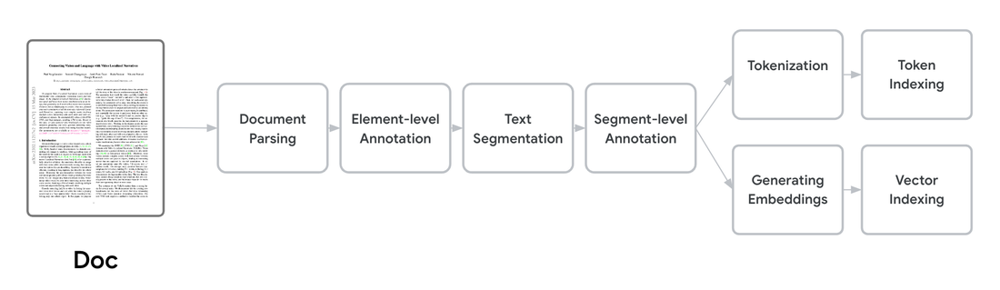
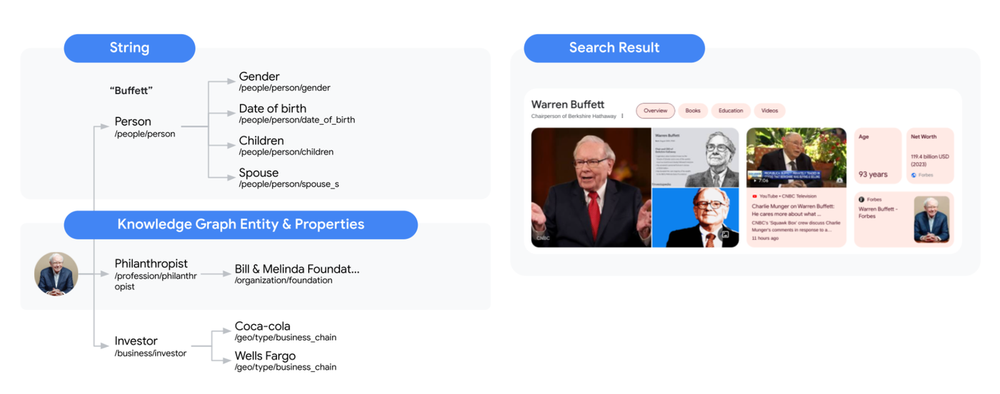
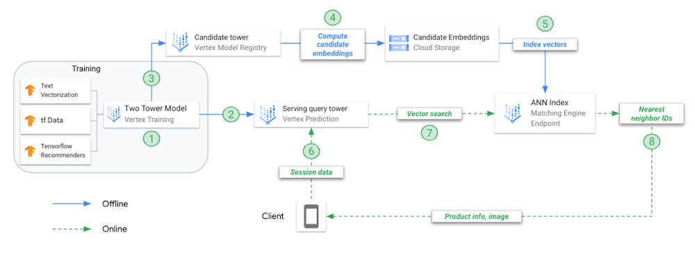
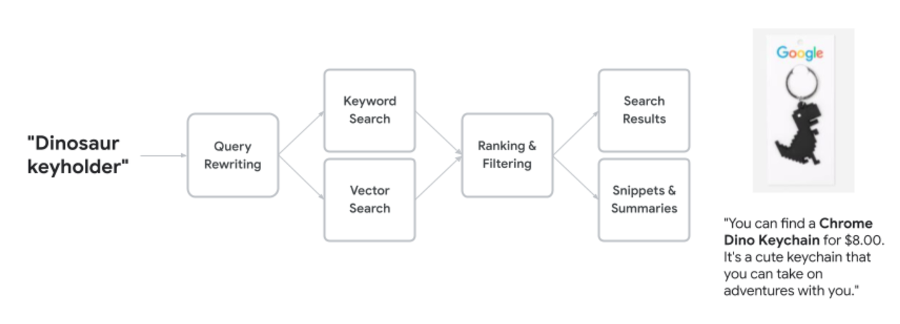

# Search in the wild

- Architecture [^8]

- Key Components of Modern Search Infrastructure
  - Data Ingestion Pipelines
    - web crawling for public internet and data connectors for anything private;
    - documents (webpages, files, records, etc.) are streamed into the indexing pipeline
    - data can be structured, semi-structured and unstructured
  - Indexing and Storage
    - Document processing/cleaning
      - 
    - lexical indexes (inverted index, TF-IDF or BM25)
      - splitting on whitespace and punctuation, lowercasing, removing stopwords, and possibly stemming or lemmatization (reducing words to their root form
      - the main goal of the IDF component is to penalize common and less meaningful terms
      - ngram based [^13]
    - vector indexes
      - generate dense vector embeddings using a general (e.g., Sentence-BERT or Huggingface MiniLM-L3-v2 [^11]) or specialized model (e.g. a product catalog encoder) [^6]
        -  trade-offs between cost, throughput and latency
      - pass them to custom, pgvector [^12] or faiss library for indexing [^11]
    - using query entropy, which meaures uncertainty associated with a search query, to adaptively merge-and-topk-select from lexical and semantic recall sets
    based on the request context i.e. the query, retailer [^11]
    - other merging options are Reciprocal Rank Fusion (RRF), Convex Combination of scores, etc [^11];
    - how does each handle updates and deletions?
    - metadata enrichment
    - knowledge graph - adds more context to search queries by providing information about things, people, or places
      - 
  - Retrieval and Query Processing
    - Query understanding and rewriting (rewriting should be tracked heavily since it is 'highly opinionated') [^9]
      - Word stemming and spell correction [^5]
      - Adding related words and synonyms
      - Removing unimportant words
      - Annotating important entities with Knowledge Graph (we’ll cover this in our second post)
    - Retrieval (candidate generation, from Ms/Bs to 100s)
      - Evolution of retrieval modeling
        - token-based matching using an inverted index of n-grams
        - Factorization-based retrieval (embedding-based model that learns similarity between <query, candidate> pairs mapping them to a shared embedding space)
        - neural deep retrieval (NDR) does the same thing as above but using deep learning [^3]
      - 
      - two-stage retrieval: an initial fast retrieval brings back a broad set of candidates, and a later stage will refine and rerank them.
      stage one is tuned for high recall and can use bi-encoder or sparse retrieval or etc to get candidates quickly.
      second stage is compute-intensive and is usually involves learning-to-rank models, Cross-encoders, etc; the second stage is tuned
      for high precision.
      - two-stage retrieval dramatically improves result quality: the first stage ensures relevant documents aren’t missed (high recall), and the second stage ensures the best results rise to the top (high precision)
  - Reranking and Personalization (from 100s to dozens)
    - cross-encoder: feed the query and a candidate document together into the model and get a relevance score
  - Filtering and boosting
    - Business Rules and Domain Logic
    - boosting could be general (new docs > old docs), user-specific (user’s preferred brands or past interactions) or domain-specific;
  - Extraction and generation
  - Performance Monitoring and Quality Assessment
    - performance metrics (latency, throughput)
    - quality metrics (relevance, click-through rates)
      - at shopify, they evaluate the search algo by 1) collecting data (user-behavior events about a search session and annotated query-rel-docs pairings);
      2) offline evaluation with Mean Average Precision (MAP) and Normalized Discounted Cumulative Gain (NDCG); 3) online evaluation, running A/B tests on
      metrics that determine success to that use case. [^7]

## Challenges:
  - Index freshness

## Google
  - Vertex AI Search [^1][^2]

## Rankers
  - RankBrain

## Vector database
  - [Research foundations](https://github.com/facebookresearch/faiss/wiki/)

  - Algorithms [^4]
    - [ScaNN](https://research.google/blog/announcing-scann-efficient-vector-similarity-search/)

  - Distance measures
    - Squared L2 (Euclidean)
    - L1 (Manhattan)
    - Dot product
    - Cosine

  - Update
    - batch
    - streaming

## Case studies
  - [twitter](https://blog.x.com/engineering/en_us/topics/infrastructure/2022/stability-and-scalability-for-search)
  - [twitter 1](https://blog.x.com/engineering/en_us/topics/infrastructure/2016/search-relevance-infrastructure-at-twitter)
  - [instacart](https://tech.instacart.com/how-instacart-built-a-modern-search-infrastructure-on-postgres-c528fa601d54)
  - [sourcediving](https://sourcediving.com/search-at-cookpad-building-new-infrastructure-dc58f4eab93f)

## Potential POCs []
  - Simplified distributed storage/query execution engine like a content cluster of vespa [^10]
  - Fastest lexical search library in C++
  - A custom vector database run over a billion vectors in under 100ms

[^1]: [part1](https://cloud.google.com/blog/products/ai-machine-learning/rags-powered-by-google-search-technology-part-1)
[^2]: [part2](https://cloud.google.com/blog/products/ai-machine-learning/rags-powered-by-google-search-technology-part-2)
[^3]: [two tower @google](https://cloud.google.com/blog/products/ai-machine-learning/scaling-deep-retrieval-tensorflow-two-towers-architecture)
[^4]: [faiss](https://github.com/facebookresearch/faiss/wiki/Faiss-indexes)
[^5]: [spelling correction @google](https://blog.google/products/search/abcs-spelling-google-search/)
[^6]: [ml inference pipeline @shopify](https://shopify.engineering/how-shopify-improved-consumer-search-intent-with-real-time-ml)
[^7]: [search evaluation @shopify](https://shopify.engineering/evaluating-search-algorithms)
[^8]: [search pipeline @canva](https://www.canva.dev/blog/engineering/search-pipeline-part-ii/)
[^9]: [query expansion](https://en.wikipedia.org/wiki/Query_expansion)
[^10]: [content cluster of vespa](https://docs.vespa.ai/en/overview.html)
[^11]: [hybrid search @instacart](https://tech.instacart.com/optimizing-search-relevance-at-instacart-using-hybrid-retrieval-88cb579b959c)
[^12]: [modern search infra using postgresql @instacart](https://tech.instacart.com/how-instacart-built-a-modern-search-infrastructure-on-postgres-c528fa601d54)
[^13]: [code search @github](https://github.blog/engineering/architecture-optimization/the-technology-behind-githubs-new-code-search/)

## companies with engineering blog posts/publications
  - Google
  - Shopify
  - Canva
  - Figma
  - Elastic
  - Amazon
  - Reddit
  - Github
  - Instacart

## Tools
  - ElasticSearch
  - Apache Beam
